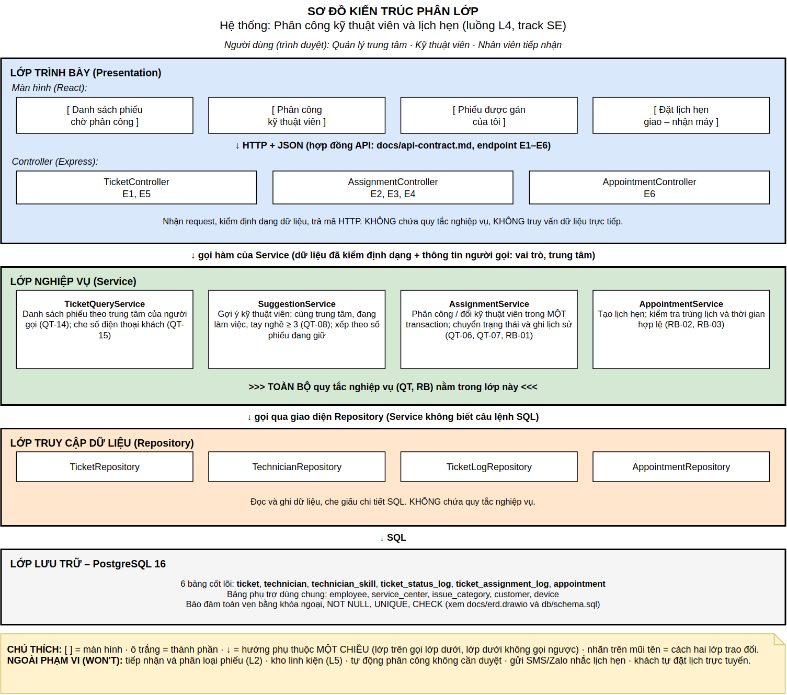
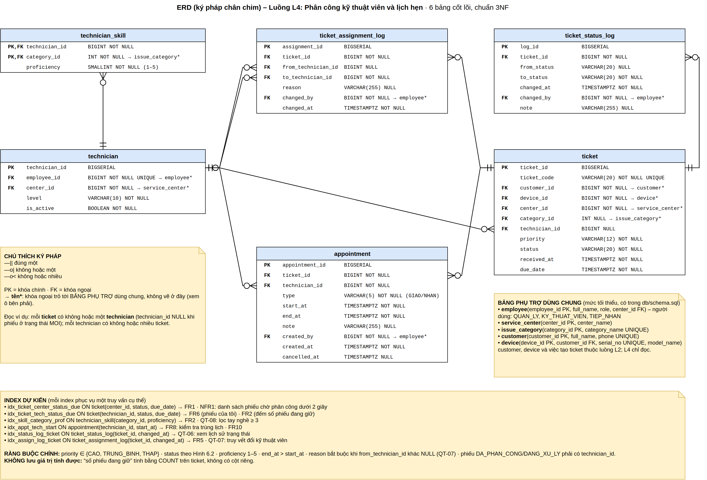
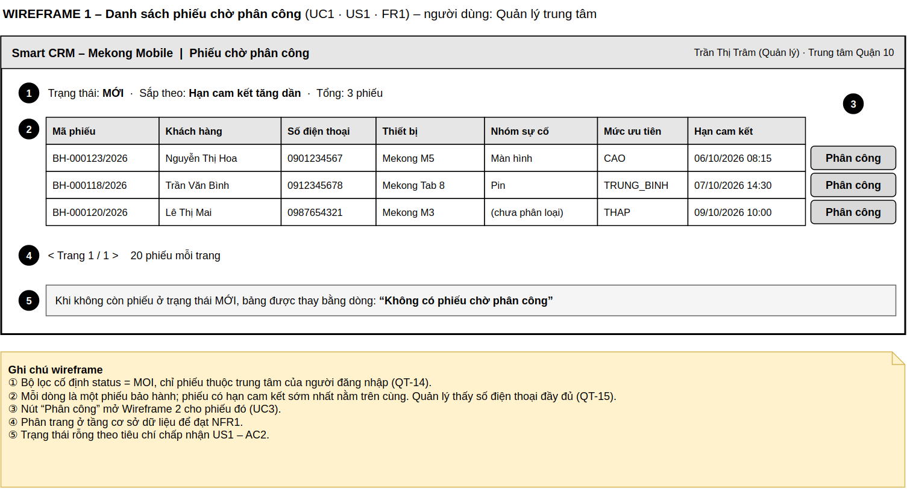
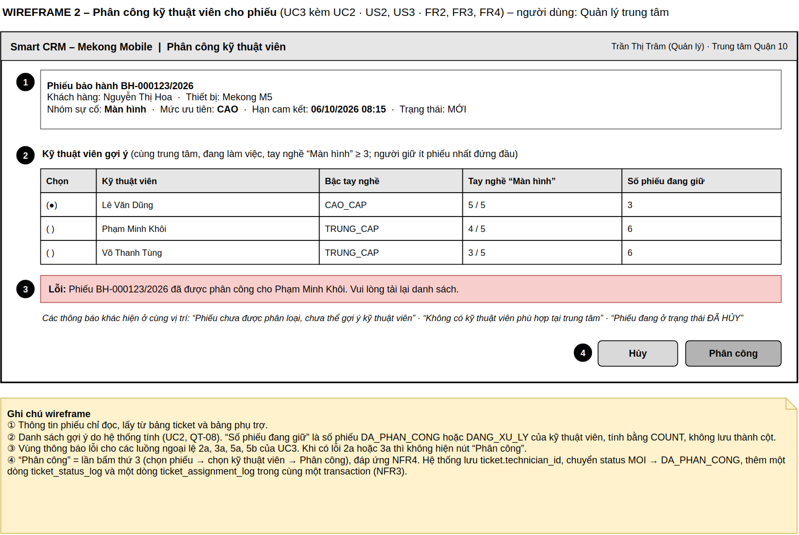
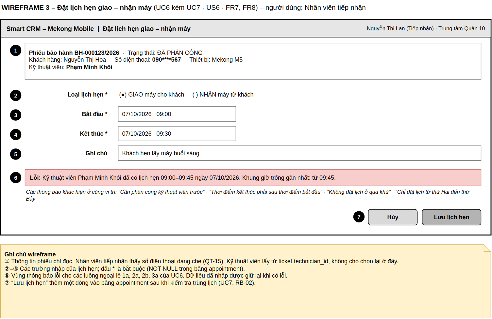

# Tài liệu thiết kế (SDD rút gọn)
## Hệ thống Smart CRM – Mekong Mobile · Luồng L4: Phân công kỹ thuật viên và lịch hẹn

**Sinh viên:** Trần Quốc Vương – 2374802010577 – Track SE  
**Học phần:** Chuyên đề Tốt nghiệp 1 · HK1 2026–2027  
**Tài liệu liên quan:** `docs/srs.md` (mã FR, NFR, US, UC, QT, RB), `docs/api-contract.md` (endpoint E1–E6), `db/schema.sql` (DDL).

Tài liệu này gồm ba thành phần còn lại của Bài tập 1: sơ đồ kiến trúc kèm giải thích lựa chọn (mục 1), mô hình dữ liệu (mục 2) và wireframe ba màn hình chính (mục 3). Mục 4 là bảng tự rà soát theo 11 mục kiểm chứng.

---

## 1. Kiến trúc hệ thống

### 1.1. Sơ đồ kiến trúc phân lớp



*File gốc: `docs/architecture.drawio`*

### 1.2. Trách nhiệm của từng lớp

| Lớp | Thành phần | Chịu trách nhiệm | KHÔNG làm |
|---|---|---|---|
| Trình bày | 4 màn hình; TicketController, AssignmentController, AppointmentController | Nhận thao tác của người dùng, kiểm định dạng dữ liệu gửi lên, hiển thị kết quả và thông báo lỗi | Không chứa quy tắc nghiệp vụ, không truy vấn dữ liệu trực tiếp |
| Nghiệp vụ | TicketQueryService, SuggestionService, AssignmentService, AppointmentService | Thi hành toàn bộ quy tắc QT-06, QT-07, QT-08, QT-14, QT-15, RB-01, RB-02, RB-03; quản lý transaction | Không biết câu lệnh SQL, không biết dữ liệu lưu bằng công nghệ gì |
| Truy cập dữ liệu | TicketRepository, TechnicianRepository, TicketLogRepository, AppointmentRepository | Đọc và ghi dữ liệu, che giấu SQL | Không chứa quy tắc nghiệp vụ, không gọi ngược lên lớp nghiệp vụ |
| Lưu trữ | PostgreSQL 16 | Giữ dữ liệu, bảo đảm toàn vẹn bằng khóa ngoại, NOT NULL, UNIQUE, CHECK | — |

**Cách các lớp trao đổi:** màn hình gọi Controller bằng HTTP + JSON theo `docs/api-contract.md`; Controller gọi hàm của Service; Service gọi Repository qua giao diện; Repository gửi SQL tới PostgreSQL. Phụ thuộc chỉ đi một chiều từ trên xuống.

### 1.3. Lần theo yêu cầu "Phân công kỹ thuật viên" qua bốn lớp

| Bước | Lớp | Thành phần | Việc làm |
|---|---|---|---|
| 1 | Trình bày | AssignmentController | Nhận `POST /api/tickets/123/assignment` với `{ "technicianId": 17 }`; kiểm `ticketId`, `technicianId` là số nguyên dương; chuyển xuống Service |
| 2 | Nghiệp vụ | AssignmentService | Kiểm phiếu thuộc trung tâm của quản lý (QT-14); kiểm kỹ thuật viên cùng trung tâm, đang làm việc, tay nghề ≥ 3 (QT-08); mở transaction |
| 3 | Truy cập dữ liệu | TicketRepository, TicketLogRepository | Cập nhật phiếu với điều kiện phiếu còn ở trạng thái MOI; thêm một dòng lịch sử trạng thái và một dòng lịch sử phân công |
| 4 | Lưu trữ | PostgreSQL | `UPDATE ticket ... WHERE ticket_id = 123 AND status = 'MOI'`; `INSERT INTO ticket_status_log`; `INSERT INTO ticket_assignment_log`; COMMIT |

- **Đường thành công (đi lên):** CSDL báo cập nhật 1 dòng → Repository trả kết quả → Service COMMIT và trả thông tin phân công → Controller trả HTTP 201 → màn hình báo thành công, phiếu rời danh sách chờ.
- **Luồng ngoại lệ 5a (phiếu vừa được quản lý khác phân công):** lệnh UPDATE cập nhật 0 dòng → Service ROLLBACK và báo lỗi "phiếu đã được phân công" → Controller chuyển thành HTTP 409 → màn hình hiện thông báo ở vùng số 3 của Wireframe 2. Không lớp nào "nhảy cóc".

### 1.4. Giải thích lựa chọn kiến trúc

1. **Gắn với NFR1 (hiệu năng).** Vì NFR1 yêu cầu danh sách phiếu chờ phân công và danh sách gợi ý hiển thị dưới 2 giây với 10.000 phiếu, tôi chọn lọc, sắp xếp và phân trang ngay ở tầng cơ sở dữ liệu, có index trên `ticket(center_id, status, due_date)`, thay vì tải toàn bộ phiếu về rồi lọc ở lớp trình bày. Đánh đổi là mỗi lần phiếu đổi trạng thái phải cập nhật thêm index; chấp nhận được vì số lần đọc danh sách nhiều hơn số lần ghi (khoảng 260 yêu cầu bảo hành mỗi tháng).

2. **Gắn với NFR3 (tin cậy).** Vì NFR3 yêu cầu khi hai quản lý gán cùng một phiếu đồng thời thì đúng một lệnh thành công, tôi gom toàn bộ thao tác phân công vào AssignmentService chạy trong một transaction, cập nhật phiếu có điều kiện `status = 'MOI'`, thay vì kiểm tra trạng thái ở Controller rồi mới ghi. Đánh đổi là người bấm sau nhận lỗi 409 và phải tải lại danh sách; tôi không dùng khóa phân tán vì prototype chỉ có một cơ sở dữ liệu.

3. **Gắn với NFR2 (bảo mật).** Vì NFR2 yêu cầu mỗi người chỉ thấy phiếu của trung tâm mình và số điện thoại khách phải che với mọi vai trò trừ quản lý, tôi đặt việc lọc theo trung tâm và che số điện thoại ở lớp nghiệp vụ (TicketQueryService), thay vì để từng màn hình tự xử lý. Đánh đổi là mọi lời gọi Service phải kèm thông tin người gọi (vai trò, trung tâm), và lớp trình bày không tự quyết định được dữ liệu nào hiển thị.

4. **Gắn với NFR4 (khả dụng).** Vì NFR4 yêu cầu quản lý phân công xong một phiếu trong không quá 3 lần bấm, tôi cho màn hình phân công nhận danh sách gợi ý đã lọc và xếp sẵn từ SuggestionService trong một lần gọi (E2), thay vì để quản lý tự tìm và lọc kỹ thuật viên. Đánh đổi là mỗi lần mở màn hình phải chạy một truy vấn đếm số phiếu đang giữ của từng kỹ thuật viên; chấp nhận được với 38 kỹ thuật viên và nhờ đó không phải lưu một cột đếm dễ sai lệch.

5. **Gắn với yêu cầu kiểm thử của BT2.** Vì BT2 yêu cầu unit test cho lớp nghiệp vụ, tôi tách lớp Repository thành giao diện riêng để khi test có thể thay bằng repository giả trong bộ nhớ, không cần cơ sở dữ liệu thật. Đánh đổi là thêm một lớp trừu tượng; chấp nhận được ở quy mô 6 bảng.

Tôi **không** dùng microservices, hàng đợi hay cache vì không có yêu cầu phi chức năng nào trong `docs/srs.md` cần đến.

---

## 2. Mô hình dữ liệu

### 2.1. ERD

ERD dùng ký pháp chân chim, gồm 6 bảng cốt lõi của luồng L4. Các khóa ngoại có dấu * trỏ tới bảng phụ trợ dùng chung, được liệt kê trong ô ghi chú của sơ đồ.



*File gốc: `docs/erd.drawio` · DDL: `db/schema.sql` (đã chạy thử trên PostgreSQL 16)*

### 2.2. Sáu bảng cốt lõi và truy vết ngược về yêu cầu

| Bảng | Ý nghĩa | Khóa chính | Phục vụ yêu cầu |
|---|---|---|---|
| `ticket` | Phiếu bảo hành (chỉ giữ các cột luồng L4 cần) | `ticket_id` | FR1, FR3, FR4, FR6, FR9 |
| `technician` | Kỹ thuật viên | `technician_id` | FR2, FR3, FR5, FR9 |
| `technician_skill` | Tay nghề của kỹ thuật viên theo nhóm sự cố | (`technician_id`, `category_id`) | FR2, FR4 (QT-08) |
| `ticket_status_log` | Lịch sử chuyển trạng thái phiếu | `log_id` | FR3 (QT-06) |
| `ticket_assignment_log` | Lịch sử phân công và đổi kỹ thuật viên | `assignment_id` | FR3, FR5 (QT-07) |
| `appointment` | Lịch hẹn giao – nhận máy | `appointment_id` | FR7, FR8, FR10 |

Kiểm ngược lại: FR1–FR10 đều có ít nhất một bảng phục vụ; không có bảng nào không gắn với yêu cầu.

**Bảng phụ trợ dùng chung** (mức tối thiểu, không tính vào 6 bảng cốt lõi): `employee`, `service_center`, `issue_category`, `customer`, `device`. Các bảng `customer`, `device` và việc tạo `ticket` thuộc luồng L2; luồng L4 chỉ đọc.

### 2.3. Quan hệ

| Quan hệ | Lực lượng | Cách cài đặt |
|---|---|---|
| Kỹ thuật viên CÓ tay nghề theo nhóm sự cố | 1 : N | FK `technician_id` ở `technician_skill` |
| Kỹ thuật viên ĐƯỢC GÁN phiếu | 0..1 : N | FK `technician_id` ở `ticket`, cho phép NULL |
| Phiếu CÓ lịch sử trạng thái | 1 : N | FK `ticket_id` ở `ticket_status_log` |
| Phiếu CÓ lịch sử phân công | 1 : N | FK `ticket_id` ở `ticket_assignment_log` |
| Kỹ thuật viên XUẤT HIỆN trong lịch sử phân công | 1 : N và 0..1 : N | FK `to_technician_id` (bắt buộc), FK `from_technician_id` (NULL ở lần đầu) |
| Phiếu CÓ lịch hẹn | 1 : N | FK `ticket_id` ở `appointment` |
| Kỹ thuật viên CÓ lịch hẹn | 1 : N | FK `technician_id` ở `appointment` |

### 2.4. Index và yêu cầu được phục vụ

| Index | Trên cột | Phục vụ |
|---|---|---|
| `idx_ticket_center_status_due` | `ticket(center_id, status, due_date)` | FR1, NFR1: danh sách phiếu chờ phân công của một trung tâm theo hạn cam kết |
| `idx_ticket_tech_status_due` | `ticket(technician_id, status, due_date)` | FR6: phiếu được gán của tôi; FR2: đếm số phiếu đang giữ |
| `idx_skill_category_prof` | `technician_skill(category_id, proficiency)` | FR2, QT-08: lọc kỹ thuật viên có tay nghề ≥ 3 |
| `idx_appt_tech_start` | `appointment(technician_id, start_at)` | FR8: kiểm tra trùng lịch; FR10 |
| `idx_status_log_ticket` | `ticket_status_log(ticket_id, changed_at)` | QT-06: xem lịch sử trạng thái của một phiếu |
| `idx_assign_log_ticket` | `ticket_assignment_log(ticket_id, changed_at)` | FR5, QT-07: truy vết các lần đổi kỹ thuật viên |

### 2.5. Chuẩn hóa và các lựa chọn có chủ ý

Mô hình ở dạng chuẩn 3NF: mỗi ô một giá trị; bảng có khóa ghép (`technician_skill`) chỉ có cột `proficiency` phụ thuộc toàn bộ khóa; tên kỹ thuật viên, tên khách, tên nhóm sự cố không lặp lại trong `ticket` mà lấy bằng phép nối.

Ba chỗ giữ lại có chủ ý:

1. **`ticket.status` và `ticket.technician_id` cùng tồn tại với hai bảng lịch sử.** Hai cột này là trạng thái hiện tại, hai bảng log là lịch sử. Giữ cột hiện tại để truy vấn danh sách (FR1, FR6) không phải tìm dòng log mới nhất, phục vụ NFR1. Đánh đổi: mỗi lần phân công phải ghi cả phiếu và log trong cùng một transaction (đã nêu ở lập luận 2).
2. **`appointment.technician_id`.** Lịch hẹn ghi kỹ thuật viên tại thời điểm hẹn; nếu phiếu đổi kỹ thuật viên thì lịch hẹn cũ vẫn đúng với người đã hẹn. Cột này cũng giúp kiểm tra trùng lịch theo kỹ thuật viên (FR8) bằng một index.
3. **`technician.center_id`.** Giữ theo từ điển dữ liệu tham chiếu (Mục 8 của case study) để lọc "cùng trung tâm" (QT-08) không phải nối sang bảng phụ trợ `employee`. Đánh đổi: khi kỹ thuật viên chuyển trung tâm phải cập nhật cả hai nơi.

**Không lưu giá trị tính được:** "số phiếu đang giữ" của kỹ thuật viên được tính bằng `COUNT` trên `ticket`, không có cột riêng.

### 2.6. Soi lại năm lỗi ERD

| Lỗi | Kết quả |
|---|---|
| Bảng cô lập | Không có: cả 6 bảng đều có quan hệ khóa ngoại |
| Thiếu bảng lịch sử | Có `ticket_status_log` và `ticket_assignment_log` |
| Lưu giá trị tính được | Không lưu số phiếu đang giữ; ba chỗ giữ lại có ghi lý do ở mục 2.5 |
| Không có index | Có 6 index, mỗi index ghi rõ phục vụ yêu cầu nào |
| Dùng khóa nghiệp vụ làm khóa chính | Dùng khóa nhân tạo; `ticket_code`, `phone`, `serial_no` chỉ đặt UNIQUE |

### 2.7. SQL DDL skeleton

Toàn bộ DDL nằm ở `db/schema.sql` (11 bảng: 6 bảng cốt lõi và 5 bảng phụ trợ, 6 index). Trích bảng `ticket` và `ticket_assignment_log`:

```sql
CREATE TABLE ticket (
    ticket_id      BIGSERIAL    PRIMARY KEY,
    ticket_code    VARCHAR(20)  NOT NULL UNIQUE,
    customer_id    BIGINT       NOT NULL REFERENCES customer(customer_id),
    device_id      BIGINT       NOT NULL REFERENCES device(device_id),
    center_id      BIGINT       NOT NULL REFERENCES service_center(center_id),   -- QT-14
    category_id    INT          REFERENCES issue_category(category_id),
    technician_id  BIGINT       REFERENCES technician(technician_id),            -- QT-07
    priority       VARCHAR(12)  NOT NULL
                     CHECK (priority IN ('CAO', 'TRUNG_BINH', 'THAP')),
    status         VARCHAR(20)  NOT NULL DEFAULT 'MOI'
                     CHECK (status IN ('MOI', 'DA_PHAN_CONG', 'DANG_XU_LY', 'CHO_LINH_KIEN',
                                       'HOAN_TAT', 'DA_DONG', 'DA_HUY')),       -- QT-06
    received_at    TIMESTAMPTZ  NOT NULL DEFAULT now(),
    due_date       TIMESTAMPTZ  NOT NULL,                                        -- QT-04
    CONSTRAINT chk_ticket_status_technician CHECK (                              -- RB-01
        (status = 'MOI' AND technician_id IS NULL)
        OR (status IN ('DA_PHAN_CONG', 'DANG_XU_LY') AND technician_id IS NOT NULL)
        OR status NOT IN ('MOI', 'DA_PHAN_CONG', 'DANG_XU_LY')
    ),
    CONSTRAINT chk_ticket_due_after_received CHECK (due_date >= received_at)
);

CREATE TABLE ticket_assignment_log (
    assignment_id       BIGSERIAL     PRIMARY KEY,
    ticket_id           BIGINT        NOT NULL REFERENCES ticket(ticket_id),
    from_technician_id  BIGINT        REFERENCES technician(technician_id),
    to_technician_id    BIGINT        NOT NULL REFERENCES technician(technician_id),
    reason              VARCHAR(255),
    changed_by          BIGINT        NOT NULL REFERENCES employee(employee_id),
    changed_at          TIMESTAMPTZ   NOT NULL DEFAULT now(),
    CONSTRAINT chk_assignment_reason CHECK (                                     -- QT-07
        from_technician_id IS NULL
        OR (reason IS NOT NULL AND length(trim(reason)) >= 5)
    ),
    CONSTRAINT chk_assignment_different CHECK (
        from_technician_id IS NULL OR from_technician_id <> to_technician_id
    )
);

-- FR1, NFR1
CREATE INDEX idx_ticket_center_status_due ON ticket (center_id, status, due_date);
CREATE INDEX idx_ticket_tech_status_due   ON ticket (technician_id, status, due_date); -- FR6, FR2
```

---

## 3. Wireframe ba màn hình chính

*File gốc: `docs/wireframes.drawio` (3 trang)*

### 3.1. Wireframe 1 – Danh sách phiếu chờ phân công (UC1)



| # | Trên màn hình | Cột trong ERD | Nguồn |
|---|---|---|---|
| 1 | Bộ lọc trạng thái MỚI, theo trung tâm | `ticket.status`, `ticket.center_id` | FR1, QT-14 |
| 2 | Mã phiếu | `ticket.ticket_code` | FR1 |
| 2 | Khách hàng, Số điện thoại | `customer.full_name`, `customer.phone` (qua `ticket.customer_id`) | FR1, QT-15 |
| 2 | Thiết bị | `device.model_name` (qua `ticket.device_id`) | FR1 |
| 2 | Nhóm sự cố | `issue_category.category_name` (qua `ticket.category_id`) | FR1 |
| 2 | Mức ưu tiên, Hạn cam kết | `ticket.priority`, `ticket.due_date` | FR1, QT-04 |
| 3 | Nút "Phân công" | — (mở Wireframe 2) | UC3 |
| 4 | Phân trang | — (không lưu) | NFR1 |
| 5 | Thông báo "Không có phiếu chờ phân công" | — (không lưu) | US1 – AC2 |

### 3.2. Wireframe 2 – Phân công kỹ thuật viên cho phiếu (UC3 kèm UC2)



| # | Trên màn hình | Cột trong ERD | Nguồn |
|---|---|---|---|
| 1 | Thông tin phiếu: mã phiếu, nhóm sự cố, mức ưu tiên, hạn cam kết, trạng thái | `ticket.ticket_code`, `issue_category.category_name`, `ticket.priority`, `ticket.due_date`, `ticket.status` | UC3 bước 2 |
| 1 | Khách hàng, Thiết bị | `customer.full_name`, `device.model_name` | UC3 bước 2 |
| 2 | Kỹ thuật viên | `employee.full_name` (qua `technician.employee_id`) | FR2 |
| 2 | Bậc tay nghề | `technician.level` | FR2 |
| 2 | Tay nghề với nhóm sự cố | `technician_skill.proficiency` | FR2, QT-08 |
| 2 | Số phiếu đang giữ | Tính bằng COUNT trên `ticket` (không lưu) | FR2 |
| 3 | Thông báo lỗi | — (không lưu) | UC3 luồng 2a, 3a, 5a, 5b |
| 4 | Nút "Phân công" | UPDATE `ticket.technician_id`, `ticket.status`; INSERT `ticket_status_log`; INSERT `ticket_assignment_log` | FR3, FR4, US3 |

### 3.3. Wireframe 3 – Đặt lịch hẹn giao – nhận máy (UC6 kèm UC7)



| # | Trên màn hình | Cột trong ERD | Nguồn |
|---|---|---|---|
| 1 | Thông tin phiếu, khách hàng, số điện thoại dạng che | `ticket.ticket_code`, `ticket.status`, `customer.full_name`, `customer.phone` | UC6, QT-15 |
| 1 | Kỹ thuật viên | `employee.full_name` (qua `ticket.technician_id`) | UC6 điều kiện trước |
| 2 | Loại lịch hẹn | `appointment.type` | FR7 |
| 3 | Bắt đầu | `appointment.start_at` | FR7, RB-03 |
| 4 | Kết thúc | `appointment.end_at` | FR7, RB-03 |
| 5 | Ghi chú | `appointment.note` | FR7 |
| 6 | Thông báo lỗi | — (không lưu) | UC6 luồng 1a, 2a, 2b, 3a |
| 7 | Nút "Lưu lịch hẹn" | INSERT `appointment` | FR7, FR8, US6 |

**Kiểm hai chiều:** mọi trường trên ba màn hình đều có cột tương ứng trong mô hình dữ liệu. Ngược lại, các cột NOT NULL của `appointment` đều được nhập (`type`, `start_at`, `end_at`) hoặc do hệ thống tự điền (`ticket_id` từ phiếu đang mở, `technician_id` từ `ticket.technician_id`, `created_by` từ người đăng nhập, `created_at` là thời điểm lưu).

---

## 4. Rà soát theo 11 mục kiểm chứng của Bài tập 1

| # | Mục kiểm chứng | Kết quả | Vị trí |
|---|---|---|---|
| 1 | Đủ 5 đầu mục: SRS, Use Case, kiến trúc, mô hình dữ liệu, wireframe | Đạt | `srs.md`; tài liệu này mục 1, 2, 3 |
| 2 | SRS đủ 6 mục; ≥ 4 FR có mã; ≥ 3 NFR có ngưỡng số | Đạt: 10 FR, 4 NFR | `srs.md` mục 1–6 |
| 3 | User Story chuẩn INVEST, có mức MoSCoW | Đạt: 8 story (3 MUST, 3 SHOULD, 2 COULD) theo yêu cầu ≥ 8 của buổi 4 | `srs.md` mục 3 |
| 4 | Mỗi FR truy vết tới ≥ 1 User Story | Đạt, không ô trống | `srs.md` mục 6 |
| 5 | Use Case Diagram ≥ 1 actor, ≥ 5 use case, có ranh giới và chú thích | Đạt: 3 actor, 9 use case | `srs.md` mục 7 |
| 6 | Đặc tả use case quan trọng nhất: luồng chính + ≥ 1 luồng ngoại lệ | Đạt: UC3 (5 ngoại lệ), UC6 (4 ngoại lệ) | `srs.md` mục 8 |
| 7 | Sơ đồ kiến trúc có chú thích, đọc được độc lập, ghi rõ cách các lớp trao đổi | Đạt | Mục 1.1 |
| 8 | ≥ 3 câu giải thích lựa chọn kiến trúc, gắn NFR, có đánh đổi | Đạt: 5 câu | Mục 1.4 |
| 9 | ERD 4–6 bảng, ≥ 2 khóa ngoại, không bảng cô lập | Đạt: 6 bảng cốt lõi, 20 khóa ngoại trong DDL | Mục 2 |
| 10 | Wireframe 3 màn hình, mọi trường đối chiếu được với mô hình dữ liệu | Đạt | Mục 3 |
| 11 | Thuật ngữ nhất quán giữa SRS và mọi sơ đồ; có bảng khai báo AI | Đạt | Bảng dưới; `ai-disclosure.md` |

**Bảng đối chiếu thuật ngữ:**

| Thuật ngữ (SRS mục 1) | Use Case Diagram | Sơ đồ kiến trúc | ERD | Wireframe |
|---|---|---|---|---|
| Phiếu bảo hành | "phiếu" | TicketController, TicketRepository | `ticket` | "Phiếu bảo hành", "Mã phiếu" |
| Kỹ thuật viên | "kỹ thuật viên" | TechnicianRepository | `technician` | "Kỹ thuật viên" |
| Tay nghề | — | SuggestionService (tay nghề ≥ 3) | `technician_skill.proficiency` | "Tay nghề" |
| Nhóm sự cố | — | — | `issue_category`, `category_id` | "Nhóm sự cố" |
| Hạn cam kết | "hạn cam kết" (UC5) | — | `ticket.due_date` | "Hạn cam kết" |
| Trạng thái phiếu | — | AssignmentService (chuyển trạng thái) | `ticket.status`, `ticket_status_log` | "Trạng thái" |
| Lịch hẹn | "lịch hẹn" (UC6, UC9) | AppointmentService | `appointment` | "Lịch hẹn", "Loại lịch hẹn" |
| Phiếu đang giữ | — | SuggestionService | Tính bằng COUNT trên `ticket` | "Số phiếu đang giữ" |
