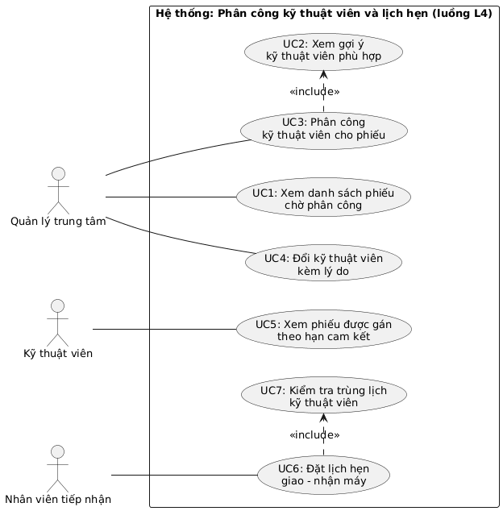

# Đặc tả yêu cầu phần mềm (SRS rút gọn)
## Hệ thống Smart CRM – Mekong Mobile · Luồng L4: Phân công kỹ thuật viên và lịch hẹn

**Sinh viên:** Trần Quốc Vương – 2374802010577 – Track SE  
**Học phần:** Chuyên đề Tốt nghiệp 1 · HK1 2026–2027  
**Tài liệu tham chiếu:** Case study Smart CRM – Mekong Mobile. Cấu trúc SRS rút gọn theo tinh thần ISO/IEC/IEEE 29148.

---

## 1. Giới thiệu và phạm vi

**Bối cảnh:** Mekong Mobile là chuỗi bán lẻ điện thoại (mô phỏng) có 6 trung tâm bảo hành và 38 kỹ thuật viên. Công ty đang xây dựng hệ thống Smart CRM theo từng luồng nghiệp vụ. Hiện nay quản lý trung tâm phân công phiếu theo trí nhớ, dẫn tới khối lượng việc lệch nhau: có kỹ thuật viên nhận 40 phiếu/tháng, người khác chỉ 12 phiếu (vấn đề V3). Khoảng 15% phiếu bị quá hạn mà không được cảnh báo (vấn đề V2).

**Luồng nghiệp vụ:** L4 – Phân công kỹ thuật viên và lịch hẹn.

**Phạm vi:** Quản lý trung tâm xem danh sách phiếu bảo hành chưa phân công, sắp theo hạn cam kết. Hệ thống gợi ý kỹ thuật viên cùng trung tâm, có tay nghề phù hợp và đang giữ ít phiếu nhất. Quản lý gán hoặc đổi kỹ thuật viên có ghi lý do. Luồng kết thúc khi phiếu có lịch hẹn giao – nhận máy không trùng lịch.

**Chủ ý KHÔNG làm (WON'T):**

| Mã | Nội dung | Lý do |
|---|---|---|
| W1 | Tiếp nhận, tạo phiếu, phân loại nhóm sự cố | Thuộc luồng L2; L4 dùng phiếu đã có làm đầu vào |
| W2 | Xuất linh kiện, chuyển phiếu sang "Chờ linh kiện" | Thuộc luồng L5 |
| W3 | Tự động phân công không cần quản lý duyệt | Quản lý vẫn là người quyết định |
| W4 | Gửi SMS/Zalo nhắc lịch hẹn | Cần hệ thống ngoài, vượt quy mô prototype |
| W5 | Khách hàng tự đặt lịch trực tuyến | Khách không đăng nhập ở phiên bản này |

**Thuật ngữ** (theo Bảng 3.1 của case study):

| Thuật ngữ | Định nghĩa | Tên kỹ thuật |
|---|---|---|
| Phiếu bảo hành | Yêu cầu bảo hành có mã duy nhất và vòng đời trạng thái | ticket |
| Trạng thái phiếu | MỚI → ĐÃ PHÂN CÔNG → ĐANG XỬ LÝ → … → ĐÃ ĐÓNG; hoặc ĐÃ HỦY | ticket_status |
| Hạn cam kết | Thời điểm chậm nhất phải hoàn tất phiếu, sinh theo mức ưu tiên | due_date |
| Nhóm sự cố | Màn hình, pin, sạc, phần mềm, nước vào, khác | issue_category |
| Kỹ thuật viên | Nhân viên sửa chữa, có tay nghề theo nhóm sự cố và trung tâm làm việc | technician |
| Tay nghề | Mức thành thạo 1–5 của kỹ thuật viên với một nhóm sự cố | technician_skill.proficiency |
| Lịch hẹn | Khung thời gian hẹn giao – nhận máy | appointment |
| Phiếu đang giữ | Phiếu đã gán cho kỹ thuật viên, trạng thái ĐÃ PHÂN CÔNG hoặc ĐANG XỬ LÝ *(suy ra)* | — |

---

## 2. Các bên liên quan và vai trò người dùng

| Vai trò | Được làm | Không được làm |
|---|---|---|
| Quản lý trung tâm | Xem phiếu chờ phân công, xem gợi ý kỹ thuật viên, gán hoặc đổi kỹ thuật viên, xem số điện thoại đầy đủ | Xem hoặc gán phiếu của trung tâm khác (QT-14) |
| Kỹ thuật viên | Xem phiếu được gán cho mình, xem lịch hẹn của mình | Tự nhận hoặc đổi phiếu; xem phiếu của người khác; thấy số điện thoại đầy đủ (QT-15) |
| Nhân viên tiếp nhận *(suy ra từ bước 11, Mục 6.1)* | Đặt lịch hẹn giao – nhận máy cho phiếu đã phân công | Phân công kỹ thuật viên; thấy số điện thoại đầy đủ (QT-15) |

---

## 3. Yêu cầu chức năng

| Mã | Yêu cầu chức năng |
|---|---|
| FR1 | Hệ thống hiển thị cho quản lý danh sách phiếu ở trạng thái MỚI của trung tâm mình, sắp theo hạn cam kết tăng dần. |
| FR2 | Với phiếu đã có nhóm sự cố, hệ thống gợi ý kỹ thuật viên cùng trung tâm, đang làm việc, tay nghề với nhóm sự cố đó ≥ 3; xếp theo số phiếu đang giữ tăng dần, rồi tay nghề giảm dần. |
| FR3 | Khi quản lý gán kỹ thuật viên, hệ thống lưu kỹ thuật viên cho phiếu, chuyển trạng thái MỚI → ĐÃ PHÂN CÔNG và ghi lịch sử kèm thời điểm, người thực hiện. |
| FR4 | Hệ thống từ chối lệnh gán khi phiếu không còn ở trạng thái MỚI hoặc kỹ thuật viên không thỏa điều kiện ở FR2. |
| FR5 | Hệ thống cho phép quản lý đổi kỹ thuật viên của phiếu ĐÃ PHÂN CÔNG, bắt buộc nhập lý do, ghi lại kỹ thuật viên cũ, mới, lý do, người đổi, thời điểm. |
| FR6 | Hệ thống hiển thị cho kỹ thuật viên danh sách phiếu được gán cho mình, sắp theo hạn cam kết tăng dần. |
| FR7 | Hệ thống cho phép nhân viên tiếp nhận tạo lịch hẹn giao hoặc nhận máy cho phiếu đã có kỹ thuật viên. |
| FR8 | Hệ thống từ chối lịch hẹn chồng lấn thời gian với lịch hẹn khác của cùng kỹ thuật viên. |

**User Story:**

| Mã | User Story | MoSCoW |
|---|---|---|
| US1 | Là quản lý trung tâm, tôi muốn xem danh sách phiếu chưa phân công sắp theo hạn cam kết để xử lý phiếu gấp trước. | MUST |
| US2 | Là quản lý trung tâm, tôi muốn hệ thống gợi ý kỹ thuật viên phù hợp theo tay nghề, trung tâm và số phiếu đang giữ để giao đúng người và chia việc đều. | MUST |
| US3 | Là quản lý trung tâm, tôi muốn gán phiếu cho kỹ thuật viên để phiếu chuyển sang "Đã phân công" và biết ai đang xử lý. | MUST |
| US4 | Là quản lý trung tâm, tôi muốn đổi kỹ thuật viên kèm lý do để truy vết được việc chuyển người. | SHOULD |
| US5 | Là kỹ thuật viên, tôi muốn xem các phiếu được gán cho tôi sắp theo hạn cam kết để ưu tiên phiếu sắp quá hạn. | SHOULD |
| US6 | Là nhân viên tiếp nhận, tôi muốn đặt lịch hẹn giao – nhận máy và được cảnh báo khi kỹ thuật viên trùng lịch để không phải hẹn lại khách. | SHOULD |

**Tiêu chí chấp nhận (story MUST):**

- **US2 – AC1.** GIVEN phiếu nhóm "Màn hình" ở trung tâm Quận 10, WHEN quản lý mở gợi ý, THEN chỉ hiện kỹ thuật viên Quận 10, đang làm việc, tay nghề "Màn hình" ≥ 3, người giữ ít phiếu nhất đứng đầu.
- **US2 – AC2.** GIVEN không có kỹ thuật viên phù hợp, WHEN quản lý mở gợi ý, THEN hệ thống báo "Không có kỹ thuật viên phù hợp" và không hiện nút Phân công.
- **US3 – AC1.** GIVEN phiếu ở trạng thái MỚI, WHEN quản lý chọn kỹ thuật viên hợp lệ và bấm Phân công, THEN phiếu chuyển sang ĐÃ PHÂN CÔNG và có một dòng lịch sử MỚI → ĐÃ PHÂN CÔNG.
- **US3 – AC2.** GIVEN phiếu vừa được quản lý khác phân công, WHEN quản lý bấm Phân công, THEN hệ thống từ chối và báo phiếu đã có người xử lý.

---

## 4. Yêu cầu phi chức năng

| Mã | Loại | Yêu cầu |
|---|---|---|
| NFR1 | Hiệu năng | Danh sách phiếu chờ phân công và danh sách gợi ý kỹ thuật viên hiển thị dưới 2 giây với 10.000 phiếu và 38 kỹ thuật viên, trên máy 8 GB RAM. |
| NFR2 | Bảo mật | Kỹ thuật viên và nhân viên tiếp nhận chỉ thấy phiếu của trung tâm mình; số điện thoại khách hiển thị dạng che (090****567) với mọi vai trò trừ quản lý. |
| NFR3 | Tin cậy | Phân công và đổi kỹ thuật viên chạy trong một transaction; khi 2 quản lý gán cùng một phiếu đồng thời, đúng 1 lệnh thành công và không phiếu nào có 2 kỹ thuật viên. |
| NFR4 | Khả dụng | Quản lý hoàn tất phân công một phiếu trong không quá 3 lần bấm và dưới 1 phút. |

---

## 5. Ràng buộc và quy tắc nghiệp vụ

| Mã | Quy tắc | Nguồn |
|---|---|---|
| QT-04 | Hạn cam kết: CAO 24 giờ, TRUNG_BINH 72 giờ, THAP 120 giờ; chỉ tính thứ Hai – thứ Bảy | Case study |
| QT-06 | Chuyển trạng thái đúng vòng đời, không quay lại; mọi lần chuyển đều ghi lịch sử | Case study |
| QT-07 | Mỗi phiếu tối đa một kỹ thuật viên; đổi kỹ thuật viên phải có lý do | Case study |
| QT-08 | Kỹ thuật viên phải có tay nghề ≥ 3 với nhóm sự cố và cùng trung tâm | Case study |
| QT-13 | Không xóa vật lý phiếu, lịch hẹn; chỉ đánh dấu ngừng sử dụng | Case study |
| QT-14 | Nhân viên chỉ xem dữ liệu trung tâm mình | Case study |
| QT-15 | Số điện thoại hiển thị dạng che, trừ quản lý và ban giám đốc | Case study |
| RB-01 | Chỉ phiếu MỚI được phân công; chỉ phiếu ĐÃ PHÂN CÔNG được đổi kỹ thuật viên | Suy ra từ QT-06, Hình 6.2 |
| RB-02 | Hai lịch hẹn của cùng kỹ thuật viên không được chồng lấn thời gian | Suy ra từ Mục 7 – L4 |
| RB-03 | Lịch hẹn: kết thúc sau bắt đầu, không ở quá khứ, không rơi vào Chủ nhật | Suy ra từ QT-04 |

---

## 6. Bảng truy vết yêu cầu

| Mã FR | Yêu cầu chức năng | User Story | Use Case | MoSCoW | Test case (BT3) |
|---|---|---|---|---|---|
| FR1 | Danh sách phiếu MỚI theo hạn cam kết | US1 | UC1 | MUST | |
| FR2 | Gợi ý kỹ thuật viên phù hợp | US2 | UC2 | MUST | |
| FR3 | Gán kỹ thuật viên, chuyển trạng thái, ghi lịch sử | US3 | UC3 | MUST | |
| FR4 | Từ chối gán sai điều kiện | US3 | UC3 | MUST | |
| FR5 | Đổi kỹ thuật viên có lý do | US4 | UC4 | SHOULD | |
| FR6 | Kỹ thuật viên xem phiếu của mình | US5 | UC5 | SHOULD | |
| FR7 | Tạo lịch hẹn giao/nhận máy | US6 | UC6 | SHOULD | |
| FR8 | Từ chối lịch hẹn trùng | US6 | UC7 | SHOULD | |

---

## 7. Use Case Diagram

*Mã nguồn: `docs/usecase.puml`*

| Actor | Use case |
|---|---|
| Quản lý trung tâm | UC1, UC3 (kèm UC2), UC4 |
| Kỹ thuật viên | UC5 |
| Nhân viên tiếp nhận | UC6 (kèm UC7) |

- `<<include>>` UC3 → UC2: lần phân công nào cũng phải qua bước gợi ý để bảo đảm QT-08.
- `<<include>>` UC6 → UC7: lần đặt lịch nào cũng phải kiểm tra trùng lịch (RB-02).

---

## 8. Đặc tả use case

### UC3 – Phân công kỹ thuật viên cho phiếu

- **Actor chính:** Quản lý trung tâm
- **Mục tiêu:** Giao phiếu cho đúng kỹ thuật viên, cân bằng khối lượng việc.
- **Điều kiện trước:** Quản lý đã đăng nhập; phiếu ở trạng thái MỚI, thuộc trung tâm của quản lý.
- **Điều kiện sau:** Phiếu ở ĐÃ PHÂN CÔNG, có đúng một kỹ thuật viên; có một dòng lịch sử chuyển trạng thái.
- **Liên quan:** US2, US3 · FR2, FR3, FR4 · **Mức ưu tiên:** MUST

**Luồng chính**
1. Quản lý chọn một phiếu trong danh sách phiếu chờ phân công (UC1).
2. Hệ thống hiển thị thông tin phiếu: mã phiếu, nhóm sự cố, mức ưu tiên, hạn cam kết.
3. Hệ thống hiển thị danh sách kỹ thuật viên gợi ý. [include UC2]
4. Quản lý chọn một kỹ thuật viên, bấm "Phân công".
5. Hệ thống kiểm tra phiếu vẫn ở MỚI và kỹ thuật viên vẫn thỏa QT-08.
6. Hệ thống lưu kỹ thuật viên, chuyển MỚI → ĐÃ PHÂN CÔNG, ghi lịch sử kèm thời điểm và người thực hiện.
7. Hệ thống báo thành công; phiếu rời khỏi danh sách chờ.

**Luồng ngoại lệ**
- **2a.** Phiếu chưa có nhóm sự cố → báo "Phiếu chưa được phân loại", không hiện nút Phân công; quay về bước 1.
- **3a.** Không có kỹ thuật viên phù hợp → báo "Không có kỹ thuật viên phù hợp tại trung tâm"; phiếu giữ nguyên MỚI.
- **5a.** Phiếu vừa được quản lý khác phân công → từ chối, báo "Phiếu đã được phân công cho <tên kỹ thuật viên>", làm mới danh sách.
- **5b.** Phiếu đã bị hủy → từ chối, báo phiếu ở trạng thái ĐÃ HỦY.
- **6a.** Lỗi khi lưu → rollback toàn bộ; phiếu vẫn MỚI, không có lịch sử ghi dở (NFR3).

### UC6 – Đặt lịch hẹn giao – nhận máy

- **Actor chính:** Nhân viên tiếp nhận
- **Mục tiêu:** Chốt khung giờ giao/nhận máy mà kỹ thuật viên không bị trùng lịch.
- **Điều kiện trước:** Phiếu đã có kỹ thuật viên và thuộc trung tâm của nhân viên.
- **Điều kiện sau:** Một lịch hẹn được lưu, gắn với phiếu và kỹ thuật viên.
- **Liên quan:** US6 · FR7, FR8 · **Mức ưu tiên:** SHOULD

**Luồng chính**
1. Nhân viên mở phiếu, chọn "Đặt lịch hẹn".
2. Nhân viên chọn loại (GIAO hoặc NHẬN máy), thời điểm bắt đầu và kết thúc.
3. Hệ thống kiểm tra kỹ thuật viên có trùng lịch không. [include UC7]
4. Hệ thống lưu lịch hẹn và hiển thị lại thông tin.

**Luồng ngoại lệ**
- **1a.** Phiếu chưa có kỹ thuật viên → không cho đặt lịch, báo "Cần phân công kỹ thuật viên trước".
- **2a.** Kết thúc không sau bắt đầu hoặc thời điểm ở quá khứ → từ chối, báo trường sai, giữ dữ liệu đã nhập.
- **2b.** Thời điểm rơi vào Chủ nhật → từ chối, báo "Chỉ đặt lịch từ thứ Hai đến thứ Bảy" (RB-03).
- **3a.** Kỹ thuật viên đã có lịch chồng lấn → từ chối, hiển thị lịch bị trùng và gợi ý khung giờ trống gần nhất; quay về bước 2.